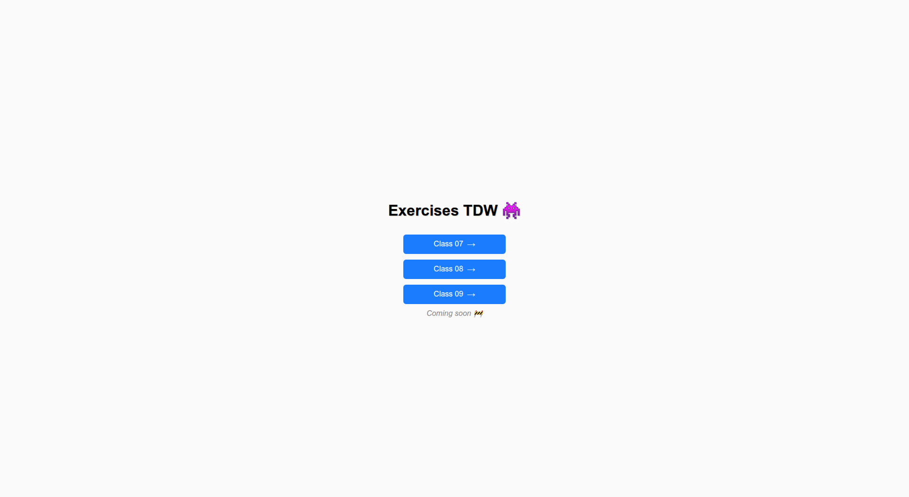
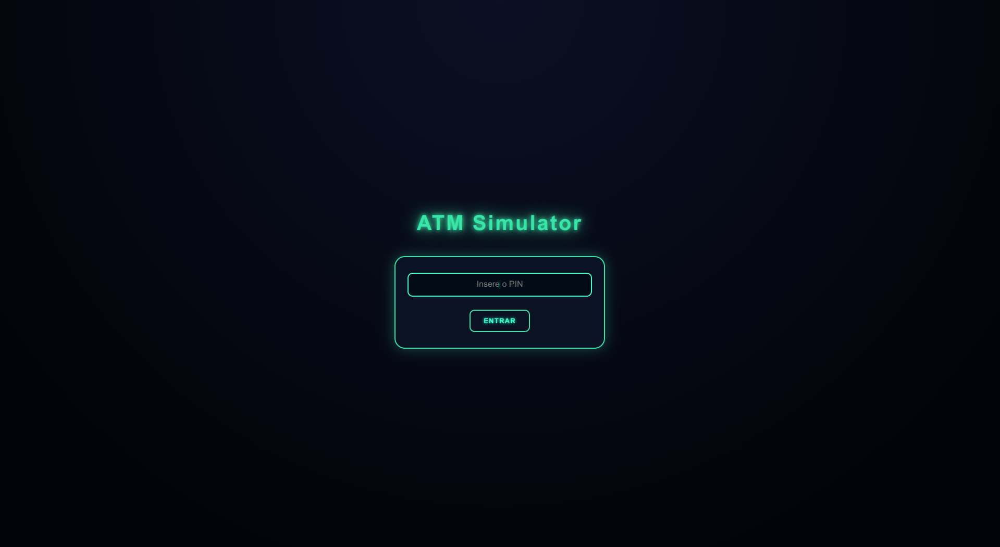

# 🧩 TDW - Exercícios React (M2 - 2025/2026)

Repositório dos exercícios desenvolvidos na Unidade Curricular **Tecnologias e Desenvolvimento Web**, Mestrado em Comunicação e Tecnologias Web (Universidade de Aveiro)

---

## Aula 7 - To-Do List Barroca

> Uma aplicação de lista de tarefas elegante, inspirada no estilo barroco, onde a organização e o design se encontram.

<p align="center">
  
</p>

<p align="center">
  
  
  
  
</p>

---

### Funcionalidades

- ✅ **Adicionar Tarefas** – Cria novas tarefas facilmente.
- ✅ **Filtrar por Estado** – Mostra todas, apenas as ativas ou as concluídas.
- ✅ **Pesquisar Tarefas** – Pesquisa por texto em tempo real.
- ✅ **Guardar Localmente** – A tua lista é guardada no localStorage (não se perde no refresh).
- ✅ **Eliminar com Confirmação** – Podes apagar uma tarefa, as concluídas ou toda a lista — sempre com confirmação.
- ✅ **Interface Arrastável** – Move o painel da lista para qualquer posição no ecrã.
- ✅ **Design Barroco Responsivo** – Interface elegante com fundo dourado e efeito de vidro.

---

### Tecnologias Utilizadas

- **React** – Estrutura principal da aplicação  
- **LocalStorage API** – Armazenamento persistente  
- **CSS personalizado** – Estilo inspirado no barroco clássico  
- **Hooks React (useState, useEffect)** – Gestão de estado e ciclo de vida  

---

### Como Executar Localmente

Para iniciar a aplicação em modo de desenvolvimento, basta executar o comando abaixo no terminal:

```bash
npm start
```

## Aula 8 
### Índice de Exercícios e Melhorias na To-Do List
> Evolução da aplicação, introduzindo índice de exercícios, estilização modular, tipagem de props e gestão centralizada de estado com Context API

<p align="center"> 
   
</p> 
<p align="center">  
   
   
   </p>

### Funcionalidades e Melhorias

- ✅ **Indice de Exercícios** – Navegação entre exercícios com React Router.
- ✅ **Estilização Modular** – Uso de CSS Modules para componentes isolados.
- ✅ **Tipagem de Props** – Implementação de prop-types ou TypeScript.
- ✅ **Atualização do Título** – useEffect mostra o número de tarefas ativas.
- ✅ **Gestão de Estado com Context API** – Estado centralizado no App e distribuído aos filhos.
- ✅ **Estrutura Modular** – Preparada para adicionar novos exercícios sem alterar o código existente.

---

### Tecnologias Utilizadas

- **React** – Framework principal 
- **React Router** – Navegação entre exercícios 
- **Prop-Types / TypeScript** – Tipagem de props
- **Context API** – Gestão global do estado 
- **Hooks (useState, useEffect)** –  Gestão de estado e efeitos

---

### Como Executar Localmente

Para iniciar a aplicação em modo de desenvolvimento, basta executar o comando abaixo no terminal:

```bash
npm start
```

## Aula 9
### ATM com Redux Toolkit
> Uma aplicação de caixa multibanco simulada, utilizando Redux Toolkit para gestão do estado, com autenticação por PIN e segunda verificação via código aleatório (simulado no console)


<p align="center">
  
</p>
<p align="center"> 
    
   
   
</p>

---
### Funcionalidades Implementadas

- ✅ **Saldo Atual** – Exibe o saldo disponível do Utilizador.
- ✅ **Depositar Dinheiro** – Incrementa o saldo ao clicar no botão “Depositar”.
- ✅ **Levantar Dinheiro** – Decrementa o saldo ao clicar no botão “Levantar”.
- ✅ **Verificação de PIN** – Só permite operações se o PIN estiver correto.
- ✅ **Prevenção de Saldo Negativo** – Não permite levantar mais do que o saldo disponível.
- ✅ **Mensagens Informativa** – Feedback para operações inválidas ou sucesso.
- ✅ **Redux Toolkit** – Store mantém múltiplas contas, actions separadas para deposit/withdraw.

---

### Tecnologias Utilizadas

- **Redux Toolkit** – Gestão global do estado da aplicação, incluindo múltiplas contas.
- **React Redux** – Ligação entre componentes React e a store Redux.
- **Redux DevTools** – Ferramenta para inspeção e debug do estado global e actions.
- **React Developer Tools** – Ferramenta de inspeção e debug de componentes React.
- **Hooks do React (`useState`, `useEffect`)** – Gestão local do estado, efeitos e interações do usuário.

### Como Executar Localmente

Para iniciar a aplicação em modo de desenvolvimento, basta executar o comando abaixo no terminal:

```bash
npm start
```

